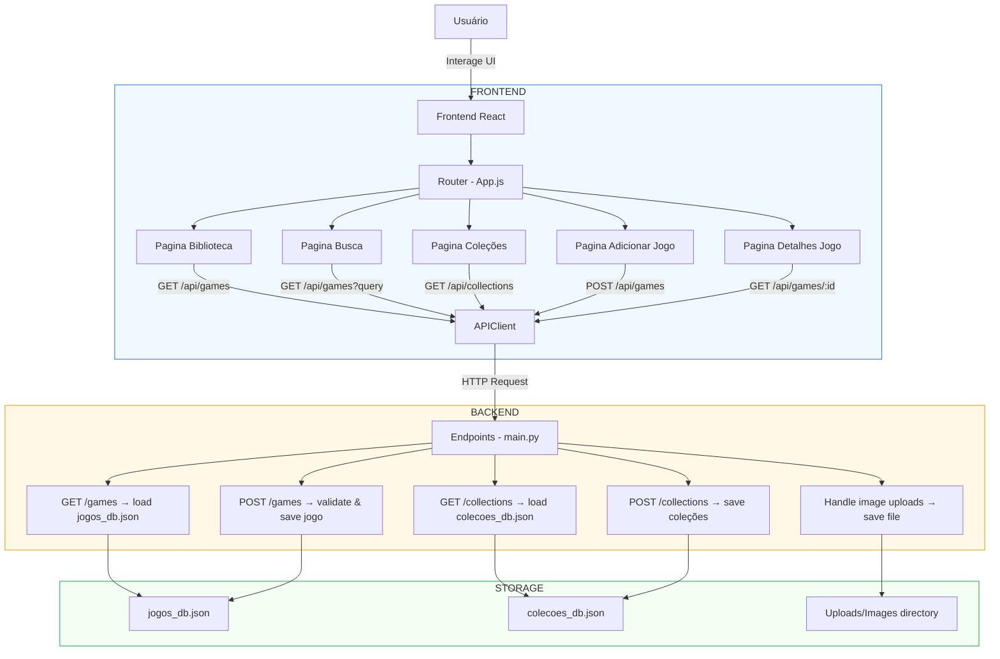

# Salsilauncher (versão de testes)

O Salsilauncher é um protótipo de um launcher de jogos com interface desenvolvida em React e backend em FastAPI.  
O projeto ainda está em desenvolvimento inicial e esta versão serve como base estrutural para organizar a arquitetura e iniciar o fluxo de comunicação entre frontend e backend.

## Estrutura do Projeto

```
└── salsifake-salsilauncher/
    ├── README.md
    ├── DEVELOPMENT.md
    ├── ROADMAP.md
    ├── run_backend.bat
    ├── .env.example
    ├── backend/
    │   ├── __init__.py
    │   ├── colecoes_db.json
    │   ├── jogos_db.json
    │   ├── main.py
    │   ├── requirements.txt
    │   ├── data/
    │   │   ├── __init__.py
    │   │   ├── paths.py
    │   │   └── storage.py
    │   ├── models/
    │   │   ├── AvaliacaoDetalhada.py
    │   │   ├── Colecao.py
    │   │   ├── Jogo
    │   │   └── Links
    │   ├── tests/
    │   │   └── test_placeholder.py
    │   └── utils/
    │       └── image_processing.py
    ├── frontend/
    │   ├── README.md
    │   ├── package.json
    │   ├── public/
    │   │   ├── index.html
    │   │   ├── manifest.json
    │   │   └── robots.txt
    │   └── src/
    │       ├── App.css
    │       ├── App.js
    │       ├── App.test.js
    │       ├── index.css
    │       ├── index.js
    │       ├── reportWebVitals.js
    │       ├── setupTests.js
    │       ├── components/
    │       │   ├── AccordionItem.css
    │       │   ├── AccordionItem.js
    │       │   ├── CollectionCard.css
    │       │   ├── CollectionCard.js
    │       │   ├── GameCard.css
    │       │   ├── GameCard.js
    │       │   ├── Sidebar.css
    │       │   ├── Sidebar.js
    │       │   ├── StarRating.css
    │       │   └── StarRating.js
    │       └── pages/
    │           ├── AdicionarJogoPage.js
    │           ├── Biblioteca.js
    │           ├── BuscaPage.css
    │           ├── BuscaPage.js
    │           ├── ColecoesPage.css
    │           ├── ColecoesPage.js
    │           ├── DetalhesJogo.css
    │           └── DetalhesJogo.js
    └── .github/
        └── PULL_REQUEST_TEMPLATE.md
```

## Fluxograma do Projeto



## Como Rodar o Projeto

### Backend (FastAPI)

```
cd backend
python -m venv venv
venv\Scripts\activate
pip install -r requirements.txt
uvicorn main:app --reload
```

### Frontend (React + Vite)

```
cd frontend
npm install
npm run dev
```

## Endpoints Atuais

### GET /games

Retorna a lista de jogos de teste definida em `routers/games.py`.

```json
[
  {
    "id": 1,
    "name": "Hollow Knight",
    "path": "C:/Games/HollowKnight/HollowKnight.exe"
  }
]
```

## Arquitetura do Projeto

### Backend
- Desenvolvido com FastAPI.
- Roteadores em `routers/`.
- Modelos em `models/`.
- Endpoints básicos, retornando dados estáticos.

### Frontend
- Desenvolvido com React (Vite).
- Navegação definida em `App.jsx`.
- Páginas: Home e Library.
- Componente `GameCard.jsx`.
- Comunicação via `services/api.js`.

## Melhorias Sugeridas

### Backend
- Adicionar banco de dados.
- Criar CRUD de jogos.
- Implementar detecção automática de executáveis.

### Frontend
- Criar estado global.
- Criar modal para adicionar jogos.
- Adicionar tratamento de erros.

### Estrutura Geral
- Criar documentação em `/docs`.
- Preparar integração com Electron.

## Status Atual

- Estrutura inicial do backend pronta
- Estrutura inicial do frontend pronta
- Comunicação React → FastAPI funcionando
- Projeto pronto para expansão

## Licença

MIT
